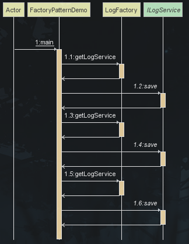
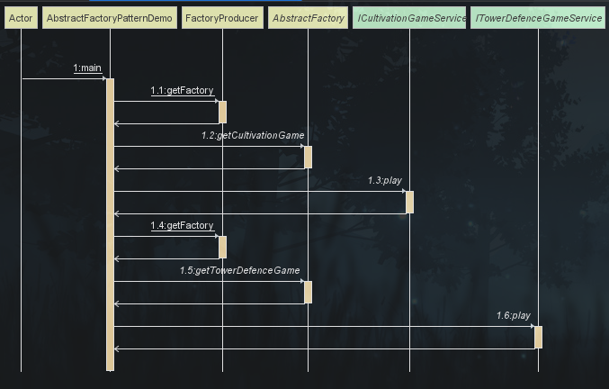
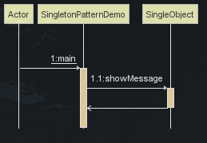
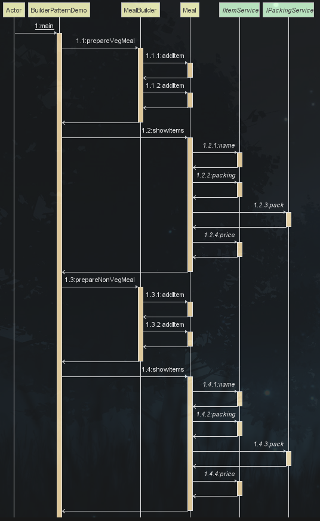

# 设计模式

设计模式（Design
pattern）代表了最佳的实践，通常被有经验的面向对象的软件开发人员所采用。设计模式是软件开发人员在软件开发过程中面临的一般问题的解决方案。这些解决方案是众多软件开发人员经过相当长的一段时间的试验和错误总结出来的。
> 本教程将通过 Java 实例，一步一步向您讲解设计模式的概念。

# 设计模式的类型

| 序号 | 模式 & 描述                                                                                         | 包括                                                                                                                                                                                                                                                                                                                                                |
|----|-------------------------------------------------------------------------------------------------|---------------------------------------------------------------------------------------------------------------------------------------------------------------------------------------------------------------------------------------------------------------------------------------------------------------------------------------------------|
| 1  | 创建型模式<br/>这些设计模式提供了一种在创建对象的同时隐藏创建逻辑的方式，而不是使用 new 运算符直接实例化对象。<br/>这使得程序在判断针对某个给定实例需要创建哪些对象时更加灵活。 | 工厂模式（Factory Pattern）<br/>抽象工厂模式（Abstract Factory Pattern）<br/>单例模式（Singleton Pattern）<br/>建造者模式（Builder Pattern）<br/>原型模式（Prototype Pattern）                                                                                                                                                                                                     |
| 2  | 结构型模式<br/>这些模式关注对象之间的组合和关系，旨在解决如何构建灵活且可复用的类和对象结构。                                               | 适配器模式（Adapter Pattern）<br/>桥接模式（Bridge Pattern）<br/>过滤器模式（Filter、Criteria Pattern）<br/>组合模式（Composite Pattern）<br/>装饰器模式（Decorator Pattern）<br/>外观模式（Facade Pattern）<br/>享元模式（Flyweight Pattern）<br/>代理模式（Proxy Pattern）                                                                                                                          |
| 3  | 行为型模式<br/>这些模式关注对象之间的通信和交互，旨在解决对象之间的责任分配和算法的封装。                                                 | 责任链模式（Chain of Responsibility Pattern）<br/>命令模式（Command Pattern）<br/>解释器模式（Interpreter Pattern）<br/>迭代器模式（Iterator Pattern）<br/>中介者模式（Mediator Pattern）<br/>备忘录模式（Memento Pattern）<br/>观察者模式（Observer Pattern）<br/>状态模式（State Pattern）<br/>空对象模式（Null Object Pattern）策略模式（Strategy Pattern）<br/>模板模式（Template Pattern）<br/>访问者模式（Visitor Pattern） |
| 4  | J2EE 模式<br/>这些设计模式特别关注表示层。这些模式是由 Sun Java Center 鉴定的。                                           | MVC 模式（MVC Pattern）<br/>业务代表模式（Business Delegate Pattern）<br/>组合实体模式（Composite Entity Pattern）<br/>数据访问对象模式（Data Access Object Pattern）<br/>前端控制器模式（Front Controller Pattern）<br/>拦截过滤器模式（Intercepting Filter Pattern）<br/>服务定位器模式（Service Locator Pattern）<br/>传输对象模式（Transfer Object Pattern）                                                   |

# 设计模式的优点

1. 提供了一种共享的设计词汇和概念，使开发人员能够更好地沟通和理解彼此的设计意图。
2. 提供了经过验证的解决方案，可以提高软件的可维护性、可复用性和灵活性。
3. 促进了代码的重用，避免了重复的设计和实现。
4. 通过遵循设计模式，可以减少系统中的错误和问题，提高代码质量。

# 设计模式的六大原则

1. 开闭原则（Open Close Principle）

   开闭原则的意思是：对扩展开放，对修改关闭。在程序需要进行拓展的时候，不能去修改原有的代码，实现一个热插拔的效果。简言之，是为了使程序的扩展性好，易于维护和升级。想要达到这样的效果，我们需要使用接口和抽象类，后面的具体设计中我们会提到这点。

2. 里氏代换原则（Liskov Substitution Principle）

   里氏代换原则是面向对象设计的基本原则之一。 里氏代换原则中说，任何基类可以出现的地方，子类一定可以出现。LSP
   是继承复用的基石，只有当派生类可以替换掉基类，且软件单位的功能不受到影响时，基类才能真正被复用，而派生类也能够在基类的基础上增加新的行为。里氏代换原则是对开闭原则的补充。实现开闭原则的关键步骤就是抽象化，而基类与子类的继承关系就是抽象化的具体实现，所以里氏代换原则是对实现抽象化的具体步骤的规范。

3. 依赖倒转原则（Dependence Inversion Principle）

   这个原则是开闭原则的基础，具体内容：针对接口编程，依赖于抽象而不依赖于具体。

4. 接口隔离原则（Interface Segregation Principle）

   这个原则的意思是：使用多个隔离的接口，比使用单个接口要好。它还有另外一个意思是：降低类之间的耦合度。由此可见，其实设计模式就是从大型软件架构出发、便于升级和维护的软件设计思想，它强调降低依赖，降低耦合。

5. 迪米特法则（最少知道原则）（Demeter Principle）

   最少知道原则是指：一个实体应当尽量少地与其他实体之间发生相互作用，使得系统功能模块相对独立。

6. 合成复用原则（Composite Reuse Principle）

   合成复用原则是指：尽量使用合成/聚合的方式，而不是使用继承。

# 工厂模式

> 工厂模式（Factory Pattern）是 Java
> 中最常用的设计模式之一，这种类型的设计模式属于创建型模式，它提供了一种创建对象的最佳方式。<br/>
> 工厂模式提供了一种创建对象的方式，而无需指定要创建的具体类。<br/>
> 工厂模式属于创建型模式，它在创建对象时提供了一种封装机制，将实际创建对象的代码与使用代码分离。

## 介绍

**意图：** 定义一个创建对象的接口，让其子类自己决定实例化哪一个工厂类，工厂模式使其创建过程延迟到子类进行。

**主要解决：** 主要解决接口选择的问题。

**何时使用：** 我们明确地计划不同条件下创建不同实例时。

**如何解决：** 让其子类实现工厂接口，返回的也是一个抽象的产品。

**关键代码：** 创建过程在其子类执行。

**优点：**

1. 一个调用者想创建一个对象，只要知道其名称就可以了。
2. 扩展性高，如果想增加一个产品，只要扩展一个工厂类就可以。
3. 屏蔽产品的具体实现，调用者只关心产品的接口。

**缺点：**
每次增加一个产品时，都需要增加一个具体类和对象实现工厂，使得系统中类的个数成倍增加，在一定程度上增加了系统的
复杂度，同时也增加了系统具体类的依赖。这并不是什么好事。

**使用场景：**

1. 日志记录器：记录可能记录到本地硬盘、系统事件、远程服务器等，用户可以选择记录日志到什么地方。
2. 数据库访问，当用户不知道最后系统采用哪一类数据库，以及数据库可能有变化时。
3. 设计一个连接服务器的框架，需要三个协议，"POP3"、"IMAP"、"HTTP"，可以把这三个作为产品类，共同实现一个接口。

**注意事项：**
作为一种创建类模式，在任何需要生成复杂对象的地方，都可以使用工厂方法模式。有一点需要注意的地方就是复杂对象适合使用工厂模式，而简单对象，特别是只需要通过
new 就可以完成创建的对象，无需使用工厂模式。如果使用工厂模式，就需要引入一个工厂类，会增加系统的复杂度。

**工厂模式包含以下几个核心角色：**

- 抽象产品（Abstract Product）：定义了产品的共同接口或抽象类。它可以是具体产品类的父类或接口，规定了产品对象的共同方法。
- 具体产品（Concrete Product）：实现了抽象产品接口，定义了具体产品的特定行为和属性。
- 抽象工厂（Abstract Factory）：声明了创建产品的抽象方法，可以是接口或抽象类。它可以有多个方法用于创建不同类型的产品。
- 具体工厂（Concrete Factory）：实现了抽象工厂接口，负责实际创建具体产品的对象。

## 实现



> 我们用日志记录器来举例，日志可以分为登录日志、操作日志和更新日志，它们都记录了用户的行为。我们可以使用工厂模式来创建日志记录器。

[工厂模式示例（Factory Pattern）](src/main/java/cn/liulingfengyu/designpattern/factorypattern)

1. 创建日志接口（抽象产品）

```java
public interface ILogService {
    /**
     * 保存日志
     */
    void save();
}
```

2. 创建日志实现类（具体产品）

```java
public class LoginLogServiceImpl implements ILogService {
    @Override
    public void save() {
        System.out.println("保存了登录日志");
    }
}
```

```java
public class OperationLogServiceImpl implements ILogService {

    @Override
    public void save() {
        System.out.println("保存了操作日志");
    }
}
```

```java
public class UpdateLogServiceImpl implements ILogService {
    @Override
    public void save() {
        System.out.println("保存了更新日志");
    }
}
```

3. 创建日志工厂（抽象工厂）

```java
/**
 * 工厂类
 *
 * @author liulingfengyu
 */
public class LogFactory {

    /**
     * 获取日志服务实现类对象
     *
     * @param logType 日志类型
     * @return 日志服务实现类对象
     */
    public ILogService getLogService(String logType) {
        ILogService logService = null;

        // 检查日志类型是否为空
        Assert.hasText(logType, "日志类型不能为空");

        // 根据日志类型创建相应的日志服务实现类对象
        if (logType.equals(LogTypeEnum.LOGIN.name())) {
            logService = new LoginLogServiceImpl();
        } else if (logType.equals(LogTypeEnum.OPERATION.name())) {
            logService = new OperationLogServiceImpl();
        } else if (logType.equals(LogTypeEnum.UPDATE.name())) {
            logService = new UpdateLogServiceImpl();
        }

        // 检查是否成功创建了日志服务实现类对象
        Assert.notNull(logService, "没有匹配的日志类型");

        return logService;
    }
}
```

4. 测试类

```java
public class FactoryPatternDemo {

    public static void main(String[] args) {
        // 创建一个日志工厂对象
        LogFactory logFactory = new LogFactory();

        // 根据登录日志类型获取登录日志服务，并调用保存方法
        ILogService loginLogService = logFactory.getLogService(LogTypeEnum.LOGIN.name());
        loginLogService.save();

        // 根据操作日志类型获取操作日志服务，并调用保存方法
        ILogService operationLogService = logFactory.getLogService(LogTypeEnum.OPERATION.name());
        operationLogService.save();

        // 根据更新日志类型获取更新日志服务，并调用保存方法
        ILogService updateLogService = logFactory.getLogService(LogTypeEnum.UPDATE.name());
        updateLogService.save();
    }
}
```

5. 测试结果

```text
保存了登录日志
保存了操作日志
保存了更新日志
```

# 抽象工厂模式

> 抽象工厂模式（Abstract Factory
>
Pattern）是围绕一个超级工厂创建其他工厂。该超级工厂又称为其他工厂的工厂。这种类型的设计模式属于创建型模式，它提供了一种创建对象的最佳方式。<br/>
> 在抽象工厂模式中，接口是负责创建一个相关对象的工厂，不需要显式指定它们的类。每个生成的工厂都能按照工厂模式提供对象。<br/>
> 抽象工厂模式提供了一种创建一系列相关或相互依赖对象的接口，而无需指定具体实现类。通过使用抽象工厂模式，可以将客户端与具体产品的创建过程解耦，使得客户端可以通过工厂接口来创建一族产品。

## 介绍

**意图：** 提供一个创建一系列相关或相互依赖对象的接口，而无需指定它们具体的类。

**主要解决：** 主要解决接口选择的问题。

**何时使用：** 系统的产品有多于一个的产品族，而系统只消费其中某一族的产品。

**如何解决：** 在一个产品族里面，定义多个产品。

**关键代码：** 在一个工厂里聚合多个同类产品。

**优点：** 当一个产品族中的多个对象被设计成一起工作时，它能保证客户端始终只使用同一个产品族中的对象。

**缺点：** 产品族扩展非常困难，要增加一个系列的某一产品，既要在抽象的 Creator 里加代码，又要在具体的里面加代码。

**抽象工厂模式包含以下几个核心角色：**

- 抽象工厂（Abstract Factory）：声明了一组用于创建产品对象的方法，每个方法对应一种产品类型。抽象工厂可以是接口或抽象类。
- 具体工厂（Concrete Factory）：实现了抽象工厂接口，负责创建具体产品对象的实例。
- 抽象产品（Abstract Product）：定义了一组产品对象的共同接口或抽象类，描述了产品对象的公共方法。
- 具体产品（Concrete Product）：实现了抽象产品接口，定义了具体产品的特定行为和属性。

> 抽象工厂模式通常涉及一族相关的产品，每个具体工厂类负责创建该族中的具体产品。客户端通过使用抽象工厂接口来创建产品对象，而不需要直接使用具体产品的实现类。

## 实现



> 我们用游戏类型和具体游戏来举例，游戏分为养成类游戏和塔防类游戏，每个游戏都有不同的类型，我们就可以使用抽象工厂模式来创建游戏。

[抽象工厂模式示例（Abstract Factory Pattern）](src/main/java/cn/liulingfengyu/designpattern/abstractfactorypattern)

1. 创建游戏接口（抽象产品）

```java
// 养成类游戏
public interface ICultivationGameService {

    void play();
}

// 塔防类游戏
public interface ITowerDefenceGameService {

    void play();
}

```

2. 创建具体游戏实现类（具体产品）

```java
// 养成类游戏
public class MultiMillionaireServiceImpl implements ICultivationGameService {
    @Override
    public void play() {
        System.out.println("养成类->大富翁");
    }
}

// 塔防类游戏
public class LeagueOfLegendsServiceImpl implements ITowerDefenceGameService {

    @Override
    public void play() {
        System.out.println("塔防类->英雄联盟");
    }
}
```

3. 创建抽象游戏工厂（抽象工厂）

```java
public abstract class AbstractFactory {

    // 创建养成类游戏
    public abstract ICultivationGameService getCultivationGame(String game);

    // 创建塔防类游戏
    public abstract ITowerDefenceGameService getTowerDefenceGame(String game);

}

//游戏工厂匹配类
public class FactoryProducer {
    public static AbstractFactory getFactory(String gameType) {
        AbstractFactory gameFactory = null;
        Assert.hasText(gameType, "游戏类型不能为空");
        if (gameType.equalsIgnoreCase(GameTypeEnum.CULTIVATION.name())) {
            gameFactory = new CultivationGameFactory();
        } else if (gameType.equalsIgnoreCase(GameTypeEnum.TOWER_DEFENCE.name())) {
            gameFactory = new TowerDefenceFactory();
        }
        return gameFactory;
    }
}

```

4. 创建具体游戏工厂（具体工厂）

```java
// 创建养成类游戏工厂
public class CultivationGameFactory extends AbstractFactory {


    @Override
    public ICultivationGameService getCultivationGame(String game) {
        // 初始化养成类游戏服务为null
        ICultivationGameService gameService = null;
        // 检查游戏名称是否为空，如果为空则抛出异常
        Assert.hasText(game, "游戏名称不能为空");
        // 判断游戏名称是否等于"MULTI_MILLIONAIRE"
        if (game.equals(CultivationGameEnum.MULTI_MILLIONAIRE.name())) {
            // 如果等于，则创建MultiMillionaireServiceImpl的实例并赋值给gameService
            gameService = new MultiMillionaireServiceImpl();
        }
        // 检查gameService是否为null，如果为null则抛出异常
        Assert.notNull(gameService, "没有匹配的游戏");
        // 返回种植类游戏服务
        return gameService;
    }

    @Override
    public ITowerDefenceGameService getTowerDefenceGame(String game) {
        return null;
    }
}

// 创建塔防类游戏工厂
public class TowerDefenceFactory extends AbstractFactory {
    @Override
    public ICultivationGameService getCultivationGame(String game) {
        return null;
    }

    @Override
    public ITowerDefenceGameService getTowerDefenceGame(String game) {
        // 初始化游戏服务为null
        ITowerDefenceGameService gameService = null;
        // 检查游戏名称是否为空
        Assert.hasText(game, "游戏名称不能为空");
        // 如果游戏名称与英雄联盟匹配
        if (game.equals(TowerDefenceGameEnum.LEAGUE_OF_LEGENDS.name())) {
            // 创建英雄联盟游戏服务实例
            gameService = new LeagueOfLegendsServiceImpl();
        }
        // 检查游戏服务是否为空，即没有匹配的游戏
        Assert.notNull(gameService, "没有匹配的游戏");
        // 返回游戏服务
        return gameService;
    }

}

```

5. 测试类

```java
public class AbstractFactoryPatternDemo {

    public static void main(String[] args) {
        // 获取种植类游戏工厂
        AbstractFactory cultivationGameFactory = FactoryProducer.getFactory(GameTypeEnum.CULTIVATION.name());
        // 获取种植类游戏服务
        ICultivationGameService multiMillionaireGameService = cultivationGameFactory.getCultivationGame(CultivationGameEnum.MULTI_MILLIONAIRE.name());
        // 调用种植类游戏服务的play方法
        multiMillionaireGameService.play();

        // 获取塔防类游戏工厂
        AbstractFactory towerDefenceFactory = FactoryProducer.getFactory(GameTypeEnum.TOWER_DEFENCE.name());
        // 获取塔防类游戏服务
        ITowerDefenceGameService leagueOfLegendsGameService = towerDefenceFactory.getTowerDefenceGame(TowerDefenceGameEnum.LEAGUE_OF_LEGENDS.name());
        // 调用塔防类游戏服务的play方法
        leagueOfLegendsGameService.play();
    }

}
```

6. 测试结果

```text
养成类->大富翁
塔防类->英雄联盟
```

# 单例模式

> 单例模式（Singleton Pattern）是 Java
> 中最简单的设计模式之一。这种类型的设计模式属于创建型模式，它提供了一种创建对象的最佳方式。<br/>
>
这种模式涉及到一个单一的类，该类负责创建自己的对象，同时确保只有单个对象被创建。这个类提供了一种访问其唯一的对象的方式，可以直接访问，不需要实例化该类的对象。<br/>
> 单例模式是一种创建型设计模式，它确保一个类只有一个实例，并提供了一个全局访问点来访问该实例。

注意：

- 单例类只能有一个实例。
- 单例类必须自己创建自己的唯一实例。
- 单例类必须给所有其他对象提供这一实例。

## 介绍

**意图：** 保证一个类仅有一个实例，并提供一个访问它的全局访问点。

**主要解决：** 一个全局使用的类频繁地创建与销毁。

**何时使用：** 当您想控制实例数目，节省系统资源的时候。

**如何解决：** 判断系统是否已经有这个单例，如果有则返回，如果没有则创建。

**关键代码：** 构造函数是私有的。

**优点：**

1. 在内存里只有一个实例，减少了内存的开销，尤其是频繁的创建和销毁实例（比如管理学院首页页面缓存）。
2. 避免对资源的多重占用（比如写文件操作）。

**缺点：** 没有接口，不能继承，与单一职责原则冲突，一个类应该只关心内部逻辑，而不关心外面怎么样来实例化。

## 实现



> 我们将创建一个 SingleObject 类。SingleObject 类有它的私有构造函数和本身的一个静态实例。
> SingleObject 类提供了一个静态方法，供外界获取它的静态实例。SingletonPatternDemo 类使用 SingleObject 类来获取
> SingleObject
> 对象。

1. 创建单例类（单例）

```java
public class SingleObject {

    //获取唯一可用的对象
    //创建 SingleObject 的一个对象
    @Getter
    private static final SingleObject instance = new SingleObject();

    //让构造函数为 private，这样该类就不会被实例化
    private SingleObject() {
    }

    public void showMessage() {
        System.out.println("Hello World!");
    }
}
```

2. 测试类

```java
public class SingletonPatternDemo {

    public static void main(String[] args) {
        //获取唯一可用的对象
        SingleObject object = SingleObject.getInstance();

        //显示消息
        object.showMessage();
    }
}
```

3. 测试结果

```text
Hello World!
```

## 单例模式的几种实现方式

单例模式的实现有多种方式，如下所示：

### 懒汉式，线程不安全

**是否 Lazy 初始化：** 是

**是否多线程安全：** 否

**实现难度：** 易

**描述：** 这种方式是最基本的实现方式，这种实现最大的问题就是不支持多线程。因为没有加锁 synchronized，所以严格意义上它并不算单例模式。

这种方式 lazy loading 很明显，不要求线程安全，在多线程不能正常工作。

```java
public class Singleton {
    private static Singleton instance;

    private Singleton() {
    }

    public static Singleton getInstance() {
        if (instance == null) {
            instance = new Singleton();
        }
        return instance;
    }
}
```

接下来介绍的几种实现方式都支持多线程，但是在性能上有所差异。

### 懒汉式，线程安全

是否 Lazy 初始化：是

是否多线程安全：是

实现难度：易

描述：这种方式具备很好的 lazy loading，能够在多线程中很好的工作，但是，效率很低，99% 情况下不需要同步。

优点：第一次调用才初始化，避免内存浪费。

缺点：必须加锁 synchronized 才能保证单例，但加锁会影响效率。
getInstance() 的性能对应用程序不是很关键（该方法使用不太频繁）。

```java
public class Singleton {
    private static Singleton instance;

    private Singleton() {
    }

    public static synchronized Singleton getInstance() {
        if (instance == null) {
            instance = new Singleton();
        }
        return instance;
    }
}
```

### 饿汉式

是否 Lazy 初始化：否

是否多线程安全：是

实现难度：易

描述：这种方式比较常用，但容易产生垃圾对象。

优点：没有加锁，执行效率会提高。

缺点：类加载时就初始化，浪费内存。

它基于 classloader 机制避免了多线程的同步问题，不过，instance 在类装载时就实例化，虽然导致类装载的原因有很多种，在单例模式中大多数都是调用
getInstance 方法， 但是也不能确定有其他的方式（或者其他的静态方法）导致类装载，这时候初始化 instance 显然没有达到 lazy
loading 的效果。

```java
public class Singleton {
    private static Singleton instance = new Singleton();

    private Singleton() {
    }

    public static Singleton getInstance() {
        return instance;
    }
}
```

### 双检锁/双重校验锁（DCL，即 double-checked locking）

JDK 版本：JDK1.5 起

是否 Lazy 初始化：是

是否多线程安全：是

实现难度：较复杂

描述：这种方式采用双锁机制，安全且在多线程情况下能保持高性能。
getInstance() 的性能对应用程序很关键。

```java
public class Singleton {
    private volatile static Singleton singleton;

    private Singleton() {
    }

    public static Singleton getSingleton() {
        if (singleton == null) {
            synchronized (Singleton.class) {
                if (singleton == null) {
                    singleton = new Singleton();
                }
            }
        }
        return singleton;
    }
}
```

### 登记式/静态内部类

是否 Lazy 初始化：是

是否多线程安全：是

实现难度：一般

描述：这种方式能达到双检锁方式一样的功效，但实现更简单。对静态域使用延迟初始化，应使用这种方式而不是双检锁方式。这种方式只适用于静态域的情况，双检锁方式可在实例域需要延迟初始化时使用。
这种方式同样利用了 classloader 机制来保证初始化 instance 时只有一个线程，它跟第 3 种方式不同的是：第 3 种方式只要
Singleton 类被装载了，那么 instance 就会被实例化（没有达到 lazy loading 效果），而这种方式是 Singleton 类被装载了，instance
不一定被初始化。因为 SingletonHolder 类没有被主动使用，只有通过显式调用 getInstance 方法时，才会显式装载 SingletonHolder
类，从而实例化 instance。想象一下，如果实例化 instance 很消耗资源，所以想让它延迟加载，另外一方面，又不希望在 Singleton
类加载时就实例化，因为不能确保 Singleton 类还可能在其他的地方被主动使用从而被加载，那么这个时候实例化 instance
显然是不合适的。这个时候，这种方式相比第 3 种方式就显得很合理。

```java
public class Singleton {
    private static class SingletonHolder {
        private static final Singleton INSTANCE = new Singleton();
    }

    private Singleton() {
    }

    public static final Singleton getInstance() {
        return SingletonHolder.INSTANCE;
    }
}
```

### 枚举

JDK 版本：JDK1.5 起

是否 Lazy 初始化：否

是否多线程安全：是

实现难度：易

描述：这种实现方式还没有被广泛采用，但这是实现单例模式的最佳方法。它更简洁，自动支持序列化机制，绝对防止多次实例化。
这种方式是 Effective Java 作者 Josh Bloch 提倡的方式，它不仅能避免多线程同步问题，而且还自动支持序列化机制，防止反序列化重新创建新的对象，绝对防止多次实例化。不过，由于
JDK1.5 之后才加入 enum 特性，用这种方式写不免让人感觉生疏，在实际工作中，也很少用。
不能通过 reflection attack 来调用私有构造方法。

```java
public enum Singleton {
    INSTANCE;

    public void whateverMethod() {
    }
}
```

**经验之谈：** 一般情况下，不建议使用第 1 种和第 2 种懒汉方式，建议使用第 3 种饿汉方式。只有在要明确实现 lazy loading
效果时，才会使用第 5 种登记方式。如果涉及到反序列化创建对象时，可以尝试使用第 6 种枚举方式。如果有其他特殊的需求，可以考虑使用第
4 种双检锁方式。

# 建造者模式

建造者模式（Builder Pattern）使用多个简单的对象一步一步构建成一个复杂的对象。这种类型的设计模式属于创建型模式，它提供了一种创建对象的最佳方式。

一个 Builder 类会一步一步构造最终的对象。该 Builder 类是独立于其他对象的。

## 介绍

**意图：** 将一个复杂的构建与其表示相分离，使得同样的构建过程可以创建不同的表示。

**主要解决：** 主要解决在软件系统中，有时候面临着"一个复杂对象"
的创建工作，其通常由各个部分的子对象用一定的算法构成；由于需求的变化，这个复杂对象的各个部分经常面临着剧烈的变化，但是将它们组合在一起的算法却相对稳定。

**何时使用：** 一些基本部件不会变，而其组合经常变化的时候。

**如何解决：** 将变与不变分离开。

**关键代码：** 建造者：创建和提供实例，导演：管理建造出来的实例的依赖关系。

**优点：**

- 分离构建过程和表示，使得构建过程更加灵活，可以构建不同的表示。
- 可以更好地控制构建过程，隐藏具体构建细节。
- 代码复用性高，可以在不同的构建过程中重复使用相同的建造者。
  缺点：

- 如果产品的属性较少，建造者模式可能会导致代码冗余。
- 建造者模式增加了系统的类和对象数量。

**使用场景：**

1. 需要生成的对象具有复杂的内部结构。
2. 需要生成的对象内部属性本身相互依赖。

建造者模式在创建复杂对象时非常有用，特别是当对象的构建过程涉及多个步骤或参数时。它可以提供更好的灵活性和可维护性，同时使得代码更加清晰可读。

**注意事项：** 与工厂模式的区别是：建造者模式更加关注与零件装配的顺序。

## 实现



我们用餐饮套餐来举例，假设有两个套餐，一个是素食套餐（包括素食汉堡，冷饮），一个是肉食套餐（包括肉食汉堡、冷饮）。

创建一个餐品类 `IItemService`（包括名称、价格和包装方式）

```java
public interface IItemService {
    //获取餐品名称
    String name();

    //获取餐品包装方式
    IPackingService packing();

    //获取餐品价格
    float price();
}
```

每个具体的餐品名称、价格不相同，但是同一类餐品包装方式是相同的。

创建同一类餐品抽象类 `AbstractBurger` 其中实现了具体的包装方式，餐品名称和价格在这里不需要实现，因为每个具体餐品都会重写。

```java
public abstract class AbstractBurger implements IItemService {

    @Override
    public IPackingService packing() {
        return new WrapperServiceImpl();
    }

}

```

创建具体餐品类 `VegBurgerServiceImpl` 具体餐品类继承了同一类餐品抽象类，并重写了具体餐品名称和价格。

```java
public class VegBurgerServiceImpl extends AbstractBurger {
    @Override
    public float price() {
        return 25.0f;
    }

    @Override
    public String name() {
        return "Veg Burger";
    }
}

```

这样我们就完成了具体餐品->同一类餐品->餐品类->套餐的构建。

现在我们扩展一个餐品，比如鸡肉汉堡，首先它是餐品，其次它也是和上面创建的同一类餐品，都是汉堡。

创建具体餐品类 `ChickenBurgerServiceImpl` 具体餐品类继承了同一类餐品抽象类，并重写了具体餐品名称和价格。

```java
public class ChickenBurgerServiceImpl extends AbstractBurger {
    @Override
    public float price() {
        return 50.5f;
    }

    @Override
    public String name() {
        return "Chicken Burger";
    }

}

```

这样我们就完成了具体餐品的扩展。

现在我们扩展一个其他类的餐品，比如冷饮，首先它是餐品。

创建同一类餐品抽象类 `AbstractColdDrink` 其中实现了具体的包装方式，餐品名称和价格在这里不需要实现，因为每个具体餐品都会重写。

```java
public abstract class AbstractColdDrink implements IItemService {
    @Override
    public IPackingService packing() {
        return new BottleServiceImpl();
    }
}
```

创建具体餐品类 `CokeServiceImpl` 具体餐品类继承了同一类餐品抽象类，并重写了具体餐品名称和价格。

```java
public class CokeServiceImpl extends AbstractColdDrink {
    @Override
    public float price() {
        return 30.0f;
    }

    @Override
    public String name() {
        return "Coke";
    }
}

```

创建具体餐品类 `PepsiServiceImpl` 具体餐品类继承了同一类餐品抽象类，并重写了具体餐品名称和价格。

```java
public class PepsiServiceImpl extends AbstractColdDrink {
    @Override
    public float price() {
        return 35.0f;
    }

    @Override
    public String name() {
        return "Pepsi";
    }
}

```

这样我们就完成了餐品的创建。

售卖一般都会有套餐的概念，下面我们封装一个套餐类。

创建套餐类 `Meal` 类中声明了三个方法，分别是添加的餐品集合，餐品总价格计算方法，打印所有餐品信息方法。

```java
public class Meal {
    //声明一个集合，用于存储餐品
    private final List<IItemService> items = new ArrayList<>();

    //添加餐品
    public void addItem(IItemService iItemService) {
        items.add(iItemService);
    }

    //计算餐品总价格
    public float getCost() {
        float cost = 0.0f;
        for (IItemService item : items) {
            cost += item.price();
        }
        return cost;
    }

    //打印所有餐品信息
    public void showItems() {
        for (IItemService item : items) {
            System.out.print("Item : " + item.name());
            System.out.print(", Packing : " + item.packing().pack());
            System.out.println(", Price : " + item.price());
        }
    }
}
```

创建套餐构建类 `MealBuilder` 这个类就具体到了我们创建套餐了，我们创建了两个套餐，一个是素食套餐，一个是肉食套餐。

```java
public class MealBuilder {
    
    //构建素食套餐
    public Meal prepareVegMeal (){
        Meal meal = new Meal();
        meal.addItem(new VegBurgerServiceImpl());
        meal.addItem(new CokeServiceImpl());
        return meal;
    }

    //构建肉食套餐
    public Meal prepareNonVegMeal (){
        Meal meal = new Meal();
        meal.addItem(new ChickenBurgerServiceImpl());
        meal.addItem(new PepsiServiceImpl());
        return meal;
    }
}

```

最后让我们测试一下。

创建一个测试类，具体代码如下：

```java
public class BuilderPatternDemo {
    public static void main(String[] args) {
        //构建餐品对象
        MealBuilder mealBuilder = new MealBuilder();

        //构建素食套餐
        Meal vegMeal = mealBuilder.prepareVegMeal();
        System.out.println("Veg Meal");
        //打印所有餐品信息
        vegMeal.showItems();
        //打印套餐总价格
        System.out.println("Total Cost: " + vegMeal.getCost());

        //构建肉食套餐
        Meal nonVegMeal = mealBuilder.prepareNonVegMeal();
        System.out.println("\n\nNon-Veg Meal");
        //打印所有餐品信息
        nonVegMeal.showItems();
        //打印套餐总价格
        System.out.println("Total Cost: " + nonVegMeal.getCost());
    }
}
```

